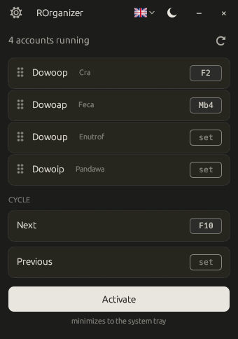
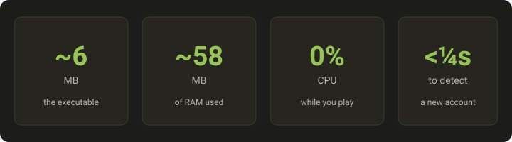

<div align="center">


# ROrganizer

**Manage your Dofus Unity accounts from the keyboard. Light and fast.**

*Playing up to 8 accounts in parallel? Switch between them with **a single keystroke or mouse click**. No interaction with Dofus, no network connection, no bloat.*

[](https://github.com/Loulouw/ROrganizer/releases)
[](#license)
[](https://github.com/Loulouw/ROrganizer/releases)
[](https://www.rust-lang.org/)
[](#-your-privacy)

<a href="README.md"> Français</a> &nbsp;·&nbsp;  **English** &nbsp;·&nbsp; <a href="README.es.md"> Español</a>

</div>

---

> ⚠️ **Beware of impostors.** ROrganizer has **no official website**.
> The only legitimate place to download the executable is the
> [Releases page of this GitHub repo](https://github.com/Loulouw/ROrganizer/releases).
> Any other site (forums, third-party download pages, "mirrors"…) is
> not from me and may contain a modified binary.

## Preview

<div align="center">
  
</div>

## Why ROrganizer?

Inspired by **nAiO Organizer** — a tool well-known in the Dofus
community — but rewritten from scratch in Rust to be lighter, start
instantly and offer a polished UI in light or dark mode.

## ✅ Your privacy

> **Offline · No data collected · Never touches the game**

- The app **never connects to any server**.
- The app **doesn't touch Dofus** at all: it doesn't read it, modify
  it, or send anything to it. It just listens for your shortcuts and
  brings the right window to the front.
- **No keystrokes are logged**. Shortcuts are matched on the fly and
  immediately forgotten.
- The only file the app writes is **its own settings** (your
  shortcuts, language and theme) in the Windows AppData folder.

## ⚡ Light and fast

<div align="center">
  
</div>

## Features

- 🔍 **Auto-detects** your Dofus accounts as soon as they're running
- 🎯 **One shortcut per account**: keyboard key or mouse button
- 🔄 **Cycle through accounts** with a next / previous shortcut
- ✋ **Drag-and-drop** to reorder accounts however you want
- 🌓 **Light or dark theme**, in FR / EN / ES
- 📍 **Lives in the Windows system tray**, one click to activate

## Get started in 3 steps

<div align="center">

| 1️⃣ &nbsp; **Download** | 2️⃣ &nbsp; **Run** | 3️⃣ &nbsp; **Configure** |
|:--|:--|:--|
| Grab the `.exe` from [Releases](https://github.com/Loulouw/ROrganizer/releases). No installer, no dependencies. | Double-click the `.exe`. That's it. ROrganizer auto-detects any Dofus accounts you've already launched. | Click **"set"** next to an account, then press the key or mouse button you want to bind. |

[](https://github.com/Loulouw/ROrganizer/releases/latest)

</div>

Works on Windows 10 and Windows 11.

> 💡 **Prefer to build from source?**
> With the `stable-x86_64-pc-windows-msvc` Rust toolchain (via [rustup](https://rustup.rs)):
> ```bash
> cargo build --release
> .\target\release\rorganizer.exe
> ```

## FAQ

**Do I have to configure each account one by one?**
No. ROrganizer **auto-detects** every Dofus account as soon as it
launches. You just bind a shortcut once by clicking "set" next to
each account — it's remembered for next time.

**What does it consume while I'm playing?**
Almost nothing: **~58 MB of RAM and 0% CPU at idle**. The app stays
silent in the background until you press one of your shortcuts.

**Could I get banned for using this?**
ROrganizer **does not interact with Dofus**. It doesn't read the
game, doesn't modify it, doesn't send any command to it. It just
brings a window to the front — exactly like `Alt+Tab` does in
Windows. That said, using third-party tools is at your own risk
regarding Ankama's terms of service.

**Do shortcuts work while I'm in-game?**
Yes. Shortcuts are listened to **at the Windows system level**, so
they work no matter which window is in front (Dofus, your browser,
another app…). One caveat: if Dofus runs as **administrator**, run
ROrganizer as administrator too.

**Windows shows a blue warning at first launch, is this normal?**
Yes. ROrganizer isn't signed with a **code-signing certificate**
(which costs around €300/year and isn't justifiable for a free
open-source project). Windows SmartScreen therefore warns about any
executable it doesn't recognize yet. Click **"More info"** then
**"Run anyway"**. To make sure you have the right binary, compare
its **SHA256** with the one posted in the
[release](https://github.com/Loulouw/ROrganizer/releases) notes —
any difference would mean the exe has been tampered with.

**How do I uninstall it?**
Just delete the `.exe`. Your preferences are stored in
`%APPDATA%\rorganizer\` — delete that folder for a full clean-up.
**No Windows registry changes, no service installed.**

## Disclaimer

Third-party tool, not affiliated with Ankama Games or the Dofus game.
Use at your own risk and check the Dofus terms of service before use.

## License

Dual-licensed at your choice:

- [MIT](LICENSE-MIT)
- [Apache 2.0](LICENSE-APACHE)

Contributions are implicitly covered by this dual licensing unless
explicitly stated otherwise.
