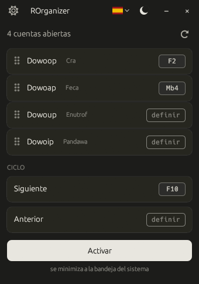
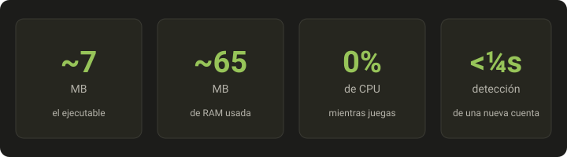

<div align="center">


# ROrganizer

**Gestiona tus cuentas Dofus Unity desde el teclado. Open-source. Sin telemetría.**

*¿Juegas con hasta 8 cuentas en paralelo? Cambia entre ellas **con una sola pulsación de tecla o ratón**. Sin interactuar con Dofus, sin conexión a internet, sin saturación.*

[](https://github.com/Loulouw/ROrganizer/releases)
[](#licencia)
[](https://github.com/Loulouw/ROrganizer/releases)
[](https://www.rust-lang.org/)
[](#-respeto-a-tu-privacidad)

<a href="README.md"> Français</a> &nbsp;·&nbsp; <a href="README.en.md"> English</a> &nbsp;·&nbsp;  **Español**

</div>

---

> ⚠️ **Cuidado con las falsificaciones.** ROrganizer se descarga
> **únicamente** desde la
> [página de Releases de este repositorio GitHub](https://github.com/Loulouw/ROrganizer/releases),
> como **un solo ejecutable**. Nunca dentro de un archivo comprimido, nunca
> como script, nunca desde un alojamiento de archivos o un enlace
> compartido en otro sitio. Cualquier archivo que lleve mi nombre y no
> corresponda a esta descripción no proviene de mí — consulta
> [SECURITY.md](SECURITY.md) para verificar tu descarga.

## Vista previa

<div align="center">
  
</div>

## ¿Por qué ROrganizer?

Inspirado en **nAiO Organizer** — una herramienta que la comunidad
Dofus conoce bien — pero **totalmente open-source**. Para una
herramienta que escucha tus atajos de teclado y observa tus
ventanas Dofus, eso lo cambia todo.

- 🔍 **Código fuente público**. Cualquiera puede leerlo y verificar
  que no hay keylogger, ni telemetría, ni conexión de red oculta.
- 🔒 **Binario verificable**. Cada release la compila GitHub desde el
  código público, nunca en una máquina personal, con una atestación de
  procedencia que puedes comprobar con un solo comando. Nadie más puede
  generar una. Consulta [SECURITY.md](SECURITY.md).
- 🛠️ **Continuidad**. Si el proyecto se detiene, cualquiera puede
  retomarlo — tu herramienta no muere con un solo mantenedor.

## ✅ Respeto a tu privacidad

> **Sin conexión · Sin recolección de datos · No toca el juego**

- La app **nunca se conecta a ningún servidor**.
- La app **no toca Dofus** : no lo lee, no lo modifica, no le envía
  nada. Solo escucha tus atajos y trae la ventana correcta al frente.
- **No se registra ninguna pulsación de tecla**. Los atajos se
  identifican al vuelo y se olvidan al instante.
- El único archivo que la app escribe es **su propia configuración**
  (tus atajos, tu idioma, tu tema) en la carpeta AppData de Windows.

## ⚡ Rendimiento

<div align="center">
  
</div>

## Funcionalidades

- 🔍 **Detección automática** de tus cuentas al iniciarse, tanto si juegas
  en **Dofus** como en **Dofus Experimental**
- 🎯 **Un atajo por cuenta** : tecla del teclado o botón del ratón
- 🔄 **Ciclo entre tus cuentas** con un atajo siguiente / anterior
- ✋ **Arrastrar y soltar** para ordenar tus cuentas a tu gusto
- 🌓 **Tema claro u oscuro**, en FR / EN / ES
- 📍 **Discreto en la bandeja del sistema** Windows, activable con
  un clic

## Empieza en 3 pasos

<div align="center">

| 1️⃣ &nbsp; **Descarga** | 2️⃣ &nbsp; **Lanza** | 3️⃣ &nbsp; **Configura** |
|:--|:--|:--|
| Descarga el `.exe` desde [Releases](https://github.com/Loulouw/ROrganizer/releases). Sin instalador, sin dependencias. | Doble clic en el `.exe`. Eso es todo. ROrganizer detecta automáticamente tus cuentas Dofus ya abiertas. | Haz clic en **«definir»** junto a una cuenta y pulsa la tecla o el botón del ratón que quieras asignarle. |

[](https://github.com/Loulouw/ROrganizer/releases/latest)

</div>

Compatible con Windows 10 y Windows 11.

> 💡 **¿Prefieres compilar desde el código fuente?**
> Con el toolchain Rust `stable-x86_64-pc-windows-msvc` (vía [rustup](https://rustup.rs)):
> ```powershell
> cargo build --release
> .\target\release\rorganizer.exe
> ```

## FAQ

**¿Tengo que configurar cada cuenta una por una?**
No. ROrganizer **detecta automáticamente** todas tus cuentas Dofus
en cuanto se inician, tanto en el cliente clásico como en **Dofus
Experimental**. Solo tienes que asignar un atajo a cada una haciendo
clic en «definir» — y queda guardado.

**¿Cuánto consume mientras juego?**
Muy poco: **~75 MB de RAM y 0 % de CPU en reposo**. La app se queda
silenciosa en segundo plano hasta que pulsas un atajo.

**¿Puedo ser baneado por usarla?**
ROrganizer **no interactúa con Dofus**. No lo lee, no lo modifica, no
le envía ningún comando. Solo trae una ventana al frente — exactamente
lo mismo que hace `Alt+Tab` en Windows. Dicho esto, el uso de
herramientas de terceros es bajo tu propia responsabilidad respecto a
las condiciones de uso de Ankama.

**¿Funcionan los atajos cuando estoy en el juego?**
Sí. Los atajos se escuchan **a nivel global de Windows**, así que
funcionan independientemente de la ventana en primer plano (Dofus,
navegador, otra app…). Una salvedad: si Dofus se ejecuta como
**administrador**, lanza ROrganizer también como administrador.

**Windows muestra una advertencia azul al primer arranque, ¿es normal?**
Sí. ROrganizer no está firmado con un **certificado de firma de
código** (que cuesta unos 300 €/año y no es justificable para un
proyecto open-source gratuito). Windows SmartScreen muestra entonces
una alerta por precaución sobre cualquier ejecutable poco conocido.
Haz clic en **«Más información»** y luego en **«Ejecutar de todos
modos»**. Para verificar que tienes el binario correcto, el
procedimiento está detallado en [SECURITY.md](SECURITY.md):
comparación del **SHA256** que GitHub muestra en la página de la
release, y **atestación de procedencia** verificable con un solo
comando a partir de la 1.3.0.

**Mi antivirus detecta un «troyano», ¿la app es peligrosa?**
No, es un **falso positivo**. Para activar tus atajos incluso cuando
Dofus está en primer plano, ROrganizer necesita escuchar el teclado y
el ratón a nivel global de Windows y luego traer una ventana al
frente. Un antivirus que juzga un programa por su forma, sin leer su
código, no puede distinguir ese mecanismo del de un programa espía. El
nombre que muestra (a menudo `Wacatac`) es una etiqueta genérica
asignada automáticamente, no la identificación de un virus conocido.

Lo que puedes comprobar tú mismo: el código fuente es público, **no se
registra ninguna pulsación de teclado** y la app **no se conecta a
ningún servidor** — verificable en el Monitor de recursos de Windows.
Cada falso positivo se notifica a Microsoft al publicar una versión,
pero la corrección tarda unos días en propagarse. Mientras tanto,
puedes añadir el `.exe` como exclusión en tu antivirus, después de
comprobar su SHA256.

**¿Cómo desinstalo la aplicación?**
Simplemente borra el `.exe`. Tus preferencias se guardan en
`%APPDATA%\rorganizer\` — puedes borrar esa carpeta para una limpieza
completa. **Sin cambios en el registro de Windows, sin servicio
instalado.**

## Aviso legal

Herramienta de terceros, sin afiliación con Ankama Games ni con el
juego Dofus. Úsala bajo tu propia responsabilidad y consulta las
condiciones de uso de Dofus antes de hacerlo.

Algunas ilustraciones mostradas en la aplicación son propiedad de
Ankama Studio. **Dofus** y las ilustraciones asociadas son marcas de
Ankama — todos los derechos reservados. Se usan aquí únicamente con
fines ilustrativos y no comerciales.

## Licencia

Distribuido bajo licencia dual, a tu elección :

- [MIT](LICENSE-MIT)
- [Apache 2.0](LICENSE-APACHE)

Cualquier contribución queda cubierta implícitamente por esta licencia
dual, salvo indicación contraria.
