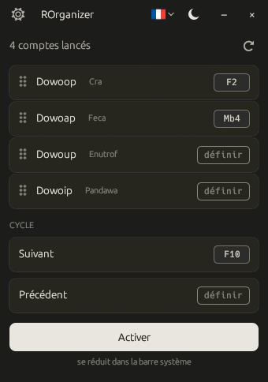
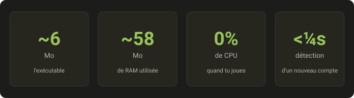

<div align="center">


# ROrganizer

**Gère tes comptes Dofus Unity et Rétro au clavier. Open-source. Sans télémétrie.**

*Tu joues jusqu'à 8 comptes en parallèle ? Bascule de l'un à l'autre **d'un seul appui clavier ou souris**. Sans interagir avec Dofus, sans connexion réseau, sans usine à gaz.*

[](https://github.com/Loulouw/ROrganizer/releases)
[](#licence)
[](https://github.com/Loulouw/ROrganizer/releases)
[](https://www.rust-lang.org/)
[](#-respect-de-ta-vie-privée)

 **Français** &nbsp;·&nbsp; <a href="README.en.md"> English</a> &nbsp;·&nbsp; <a href="README.es.md"> Español</a>

</div>

---

> ⚠️ **Attention aux contrefaçons.** ROrganizer se télécharge **uniquement**
> sur la page [Releases de ce dépôt GitHub](https://github.com/Loulouw/ROrganizer/releases),
> sous la forme d'**un seul exécutable**. Jamais dans une archive, jamais
> sous forme de script, jamais depuis un hébergeur de fichiers ou un lien
> partagé ailleurs. Tout fichier qui porte mon nom sans correspondre à
> cette description ne vient pas de moi — voir [SECURITY.md](SECURITY.md)
> pour vérifier ton téléchargement.

## Aperçu

<div align="center">
  
</div>

## Pourquoi ROrganizer ?

Inspiré de **nAiO Organizer** — un outil que la communauté Dofus connaît
bien — mais **entièrement open-source**. Pour un outil qui écoute tes
raccourcis clavier et observe les fenêtres Dofus, c'est ce qui change
tout.

- 🔍 **Code source public**. N'importe qui peut le lire et vérifier
  qu'il n'y a aucun keylogger, aucune télémétrie, aucune connexion
  réseau cachée.
- 🔒 **Binaire vérifiable**. Chaque release est compilée par GitHub
  depuis le code public, jamais sur une machine personnelle, avec une
  attestation de provenance que tu peux contrôler en une commande.
  Personne d'autre ne peut en produire une. Voir
  [SECURITY.md](SECURITY.md).
- 🛠️ **Pérennité**. Si le projet s'arrête, n'importe qui peut le
  reprendre — ton outil ne meurt pas avec un seul mainteneur.

## ✅ Respect de ta vie privée

> **Hors-ligne · Aucune donnée collectée · Ne touche pas au jeu**

- L'app **ne se connecte à aucun serveur**, jamais.
- L'app **ne touche pas à Dofus** : elle ne le lit pas, ne le modifie
  pas, ne lui envoie rien. Elle se contente d'écouter tes raccourcis
  et de mettre la bonne fenêtre devant.
- **Aucune frappe clavier n'est enregistrée**. Les raccourcis sont
  identifiés à la volée puis oubliés.
- Le seul fichier que l'app écrit, c'est **sa propre configuration**
  (tes raccourcis, ta langue, ton thème) dans le dossier AppData de
  Windows.

## ⚡ Performances

<div align="center">
  
</div>

## Fonctionnalités

- 🔍 **Détection automatique** de tes comptes dès qu'ils sont lancés, que
  tu joues sur **Dofus**, **Dofus Rétro** ou **Dofus Expérimental**
- 🎯 **Un raccourci par compte** : touche du clavier ou bouton de souris
- 🔄 **Cycle entre tes comptes** avec un raccourci suivant / précédent
- ✋ **Glisse-dépose** pour ranger tes comptes dans l'ordre que tu veux
- 🌓 **Thème clair ou sombre**, en FR / EN / ES
- 📍 **Discret dans la barre système** Windows, activable d'un clic

## Démarrage en 3 étapes

<div align="center">

| 1️⃣ &nbsp; **Télécharge** | 2️⃣ &nbsp; **Lance** | 3️⃣ &nbsp; **Configure** |
|:--|:--|:--|
| Récupère le `.exe` depuis [Releases](https://github.com/Loulouw/ROrganizer/releases). Aucun installeur, aucune dépendance. | Double-clique sur l'`.exe`. C'est tout. ROrganizer détecte automatiquement tes comptes Dofus déjà lancés. | Clique sur **« définir »** à côté d'un compte, puis presse la touche ou le bouton de souris que tu veux lui attribuer. |

[](https://github.com/Loulouw/ROrganizer/releases/latest)

</div>

Compatible Windows 10 et Windows 11.

> 💡 **Tu préfères compiler depuis les sources ?**
> Avec le toolchain Rust `stable-x86_64-pc-windows-msvc` (via [rustup](https://rustup.rs)) :
> ```powershell
> cargo build --release
> .\target\release\rorganizer.exe
> ```

## FAQ

**Faut-il configurer chaque compte un par un ?**
Non. ROrganizer **détecte automatiquement** tous tes comptes Dofus
dès qu'ils sont lancés, sur le client classique comme sur **Dofus
Rétro** et **Dofus Expérimental**. Tu n'as qu'à leur attribuer un
raccourci en cliquant sur « définir » à côté de chacun — et c'est
mémorisé. Les comptes Rétro s'affichent sans icône de classe : leur
fenêtre ne l'indique pas.

**Ça consomme quoi quand je joue ?**
Très peu : **~75 Mo de RAM et 0 % de CPU au repos**. L'app reste
silencieuse en arrière-plan jusqu'à ce que tu presses un de tes
raccourcis.

**Est-ce que je risque de me faire bannir ?**
ROrganizer **n'interagit pas avec Dofus**. Il ne lit pas le jeu, ne
le modifie pas, ne lui envoie aucune commande. Il se contente de
faire passer une fenêtre devant — exactement comme `Alt+Tab` le fait
dans Windows. Cela dit, l'utilisation d'outils tiers reste à tes
risques au regard des conditions générales d'utilisation d'Ankama.

**Mes raccourcis marchent-ils pendant que je suis en jeu ?**
Oui. Les raccourcis sont écoutés **au niveau global de Windows**,
donc ils fonctionnent peu importe la fenêtre au premier plan
(Dofus, navigateur, autre app…). À une nuance près : si Dofus tourne
en **administrateur**, lance ROrganizer également en administrateur.

**Windows affiche un avertissement bleu au premier lancement, c'est normal ?**
Oui. ROrganizer n'est pas signé avec un **certificat code-signing**
(qui coûte ~300 €/an et n'est pas justifiable pour un projet
open-source gratuit). Windows SmartScreen affiche donc une alerte
par précaution sur tout exécutable peu connu. Clique sur
**« Informations complémentaires »** puis **« Exécuter quand même »**.
Pour vérifier que tu as bien le bon binaire, la marche à suivre est
détaillée dans [SECURITY.md](SECURITY.md) : comparaison du **SHA256**
affiché par GitHub sur la page de la release, et **attestation de
provenance** vérifiable en une commande à partir de la 1.3.0.

**Mon antivirus détecte un « trojan », l'app est-elle dangereuse ?**
Non, c'est un **faux positif**. Pour déclencher tes raccourcis même
quand Dofus est au premier plan, ROrganizer doit écouter le clavier et
la souris au niveau global de Windows, puis faire passer une fenêtre
devant. Un antivirus qui juge un programme sur sa forme, sans lire son
code, ne peut pas distinguer ce mécanisme de celui d'un logiciel
espion. Le nom affiché (souvent `Wacatac`) est une étiquette générique
attribuée automatiquement, pas l'identification d'un virus connu.

Ce que tu peux vérifier toi-même : le code source est public,
**aucune frappe clavier n'est enregistrée** et l'app **ne se connecte
à aucun serveur** — constatable dans le Moniteur de ressources
Windows. Chaque faux positif est signalé à Microsoft à la publication
d'une release, mais la correction met quelques jours à se propager. En
attendant, tu peux ajouter l'`.exe` en exclusion dans ton antivirus,
après avoir vérifié son SHA256.

**Comment je désinstalle l'application ?**
Supprime simplement l'`.exe`. Tes préférences sont stockées dans
`%APPDATA%\rorganizer\` — tu peux supprimer ce dossier pour un
nettoyage complet. **Aucun registre Windows modifié, aucun service
installé.**

## Disclaimer

Outil tiers non affilié à Ankama Games ni au jeu Dofus. À utiliser à
tes risques et à consulter conformément aux conditions générales
d'utilisation de Dofus.

Certaines illustrations affichées dans l'application sont la propriété
d'Ankama Studio. **Dofus** et les visuels associés sont des marques
d'Ankama — tous droits réservés. Elles sont utilisées ici à des fins
purement illustratives et non commerciales.

## Licence

Distribué sous double licence, au choix :

- [MIT](LICENSE-MIT)
- [Apache 2.0](LICENSE-APACHE)

Toute contribution est implicitement couverte par cette double
licence, sauf mention contraire.
